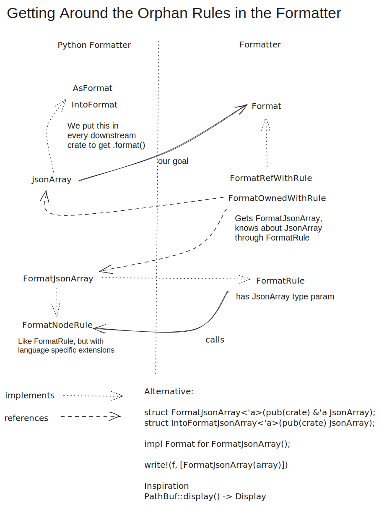

# Contributing to the Ruff Formatter

The goal of our formatter is to be compatible with Black except for rare edge cases (mostly
involving comment placement). This document outlines the expected development workflow for the
formatter and walks through some of its internals.

## Testing your changes

You can use the `ruff_python_formatter` binary to format individual files and show debug info.
It's fast to compile because it doesn't depend on `ruff`. The easiest way is to create a
`scratch.py` (or `scratch.pyi`) in the project root and run:

```shell
cargo run --bin ruff_python_formatter -- --emit stdout scratch.py
```

...which supports the `--print-ir` and `--print-comments` flag. (We recommend running with
`--print-comments`.)

<details>
<summary>Usage example</summary>

Command

```shell
cargo run --bin ruff_python_formatter -- --emit stdout --print-comments --print-ir scratch.py
```

Input

```python
def f():  # a
    pass
```

Output

```text
[
  "def f",
  group([group(["()"]), source_position(7)]),
  ":",
  line_suffix(["  # a"]),
  expand_parent,
  indent([hard_line_break, "pass", source_position(21)]),
  hard_line_break,
  source_position(21),
  hard_line_break,
  source_position(22)
]
{
    Node {
        kind: StmtFunctionDef,
        range: 0..21,
        source: `def f(): # a⏎`,
    }: {
        "leading": [],
        "dangling": [
            SourceComment {
                text: "# a",
                position: EndOfLine,
                formatted: true,
            },
        ],
        "trailing": [],
    },
}
def f():  # a
    pass
```

</details>

The other option is to use the playground (also check the playground README):

```shell
cd playground && npm install && npm run dev:wasm && npm run dev
```

Run`npm run dev:wasm` and reload the page in the browser to refresh.

**Tests** Running the entire ruff test suite is slow, `cargo test -p ruff_python_formatter` is a
lot faster. We use [insta](https://insta.rs/) to create snapshots of all tests in
`crates/ruff_python_formatter/resources/test/fixtures/ruff`. We have copied the majority of tests
over from Black to check the difference between Ruff and Black output. Whenever we have no more
differences on a Black input file, the snapshot is deleted.

**Ecosystem checks** `scripts/formatter_ecosystem_checks.sh` runs Black compatibility and stability
checks on a number of selected projects. It will print the similarity index, the percentage of lines
that remains unchanged between Black's formatting and our formatting. You could compute it as the
number of neutral lines in a diff divided by the neutral plus the removed lines. We run this script
in CI, you can view the results in a PR page under "Checks" > "CI" > "Summary" at the bottom of the
page. The stability checks catch for three common problems: The second
formatting pass looks different than the first (formatter instability or lack of idempotency),
printing invalid syntax (e.g. missing parentheses around multiline expressions) and panics (mostly
in debug assertions). You should ensure that your changes don't decrease the similarity index.

**Terminology** For `()`, `[]` and `{}` we use the following terminology:

- Parentheses: `(`, `)` or all kind of parentheses (`()`, `[]` and `{}`, e.g.
    `has_own_parentheses`)
- Brackets: `[`, `]`
- Braces: `{`, `}`

## `format_dev`

It's possible to format an entire project:

```shell
cargo run --bin ruff_dev -- format-dev --write /path/to/my_project
```

Available options:

- `--write`: Format the files and write them back to disk.
- `--stability-check`: Format twice (but don't write to disk without `--write`) and check for
    differences and crashes.
- `--multi-project`: Treat every subdirectory as a separate project. Useful for ecosystem checks.
- `--error-file`: Write all errors to the given file.
- `--log-file`: Write all messages to the given file.
- `--stats-file`: Use together with `--multi-project`, this writes the similarity index as unicode
    table to the given file.

**Large ecosystem checks** It is also possible to check a large number of repositories. This dataset
is large (~60GB), so we only do this occasionally:

```shell
# Get the list of projects
curl https://raw.githubusercontent.com/akx/ruff-usage-aggregate/master/data/known-github-tomls-clean.jsonl > github_search.jsonl
# Repurpose this script to download the repositories for us
python scripts/check_ecosystem.py --checkouts target/checkouts --projects github_search.jsonl -v $(which true) $(which true)
# Check each project for formatter stability
cargo run --bin ruff_dev -- format-dev --stability-check --error-file target/formatter-ecosystem-errors.txt --multi-project target/checkouts
```

## Helper structs

To abstract formatting something into a helper, create a new struct with the data you want to
format and implement `Format<PyFormatContext<'_>> for MyStruct`. Below is a small dummy example.

```rust
/// Helper to hide the fields for the struct
pub(crate) fn empty_parenthesized<'content>(
    comments: &'content [SourceComment],
    has_plus_prefix: bool,
) -> FormatEmptyParenthesized<'content> {
    FormatEmptyParenthesized {
        comments,
        has_plus_prefix,
    }
}

/// The wrapper struct
pub(crate) struct FormatEmptyParenthesized<'content> {
    comments: &'content [SourceComment],
    has_plus_prefix: bool,
}

impl Format<PyFormatContext<'_>> for FormatEmptyParenthesized<'_> {
    /// Here we implement the actual formatting
    fn fmt(&self, f: &mut Formatter<PyFormatContext>) -> FormatResult<()> {
        if self.has_plus_prefix {
            text("+").fmt(f)?; // This is equivalent to `write!(f, [text("*")])?;`
        }
        write!(
            f,
            [
                text("("),
                soft_block_indent(&dangling_comments(&self.comments)),
                text(")")
            ]
        )
    }
}
```

If the struct is used across modules, also adds constructor function that hides the fields of the
struct. Since it implements `Format`, you can directly use it in write calls:

```rust
write!(f, [empty_parenthesized(dangling_end_of_line_comments)])?;
```

Check the `builders` module for existing primitives.

## Adding new syntax

Occasionally, Python will add new syntax. After adding it to `ruff_python_ast`, run `generate.py`
to generate stubs for node formatting. This will add a `Format{{Node}}` struct
that implements `Default` (and `AsFormat`/`IntoFormat` impls in `generated.rs`, see orphan rules
below).

```rust
#[derive(Default)]
pub struct FormatStmtReturn;
```

We implement `FormatNodeRule<{{Node}}> for Format{{Node}}`. Inside, we destructure the item to make
sure we're not missing any field. If we want to write multiple items, we use an efficient `write!`
call, for single items `.format().fmt(f)` or `.fmt(f)` is sufficient.

```rust
impl FormatNodeRule<StmtReturn> for FormatStmtReturn {
    fn fmt_fields(&self, item: &StmtReturn, f: &mut PyFormatter) -> FormatResult<()> {
        // Here we destructure item and make sure each field is listed.
        // We generally don't need range if it's underscore-ignored
        let StmtReturn { range: _, value } = item;
        // Implement some formatting logic, in this case no space (and no value) after a return with
        // no value
        if let Some(value) = value {
            write!(
                f,
                [
                    text("return"),
                    // There are multiple different space and newline types (e.g.
                    // `soft_line_break_or_space()`, check the builders module), this one will
                    // always be translate to a normal ascii whitespace character
                    space(),
                    // `return a, b` is valid, but if it wraps we'd need parentheses.
                    // This is different from `(a, b).count(1)` where the parentheses around the
                    // tuple are mandatory
                    value.format().with_options(Parenthesize::IfBreaks)
                ]
            )
        } else {
            text("return").fmt(f)
        }
    }
}
```

If something such as list or a tuple can break into multiple lines if it is too long for a single
line, wrap it into a `group`. Ignoring comments, we could format a tuple with two items like this:

```rust
write!(
    f,
    [group(&format_args![
        text("("),
        soft_block_indent(&format_args![
            item1.format()
            text(","),
            soft_line_break_or_space(),
            item2.format(),
            if_group_breaks(&text(","))
        ]),
        text(")")
    ])]
)
```

If everything fits on a single line, the group doesn't break and we get something like `("a", "b")`.
If it doesn't, we get something like

```Python
(
    "a",
    "b",
)
```

For a list of expression, you don't need to format it manually but can use the `JoinBuilder` util,
accessible through `.join_comma_separated`. Finish will write to the formatter internally.

```rust
f.join_comma_separated(item.end())
    .nodes(elts.iter())
    .finish()
// Here we have a builder that separates each element by a `,` and a [`soft_line_break_or_space`].
// It emits a trailing `,` that is only shown if the enclosing group expands. It forces the enclosing
// group to expand if the last item has a trailing `comma` and the magical comma option is enabled.
```

If you need avoid second mutable borrows with a builder, you can use `format_with(|f| { ... })` as
a formattable element similar to `text()` or `group()`.

## Comments

Comments can either be own line or end-of-line and can be marked as `Leading`, `Trailing` and `Dangling`.

```python
# Leading comment (always own line)
print("hello world")  # Trailing comment (end-of-line)
# Trailing comment (own line)
```

Comments are automatically attached as `Leading` or `Trailing` to a node close to them, or `Dangling`
if there are only tokens and no nodes surrounding it. Categorization is automatic but sometimes
needs to be overridden in
[`place_comment`](https://github.com/astral-sh/ruff/blob/be11cae619d5a24adb4da34e64d3c5f270f9727b/crates/ruff_python_formatter/src/comments/placement.rs#L13)
in `placement.rs`, which this section is about.

```Python
[
    # This needs to be handled as a dangling comment
]
```

Here, the comment is dangling because it is preceded by `[`, which is a non-trivia token but not a
node, and followed by `]`, which is also a non-trivia token but not a node. In the `FormatExprList`
implementation, we have to call `dangling_comments` manually and stub out the
`fmt_dangling_comments` default from `FormatNodeRule`.

```rust
impl FormatNodeRule<ExprList> for FormatExprList {
    fn fmt_fields(&self, item: &ExprList, f: &mut PyFormatter) -> FormatResult<()> {
        // ...

        write!(
            f,
            [group(&format_args![
                text("["),
                dangling_comments(dangling), // Gets all the comments marked as dangling for the node
                soft_block_indent(&items),
                text("]")
            ])]
        )
    }

    fn fmt_dangling_comments(&self, _node: &ExprList, _f: &mut PyFormatter) -> FormatResult<()> {
        // Handled as part of `fmt_fields`
        Ok(())
    }
}
```

A related common challenge is that we want to attach comments to tokens (think keywords and
syntactically meaningful characters such as `:`) that have no node on their own. A slightly
simplified version of the `while` node in our AST looks like the following:

```rust
pub struct StmtWhile {
    pub range: TextRange,
    pub test: Box<Expr<TextRange>>,
    pub body: Vec<Stmt<TextRange>>,
    pub orelse: Vec<Stmt<TextRange>>,
}
```

That means in

```python
while True:  # Trailing condition comment
    if f():
        break
    # trailing while comment
# leading else comment
else:
    print("while-else")
```

the `else` has no node, we're just getting the statements in its body.

The preceding token of the leading else comment is the `break`, which has a node, the following
token is the `else`, which lacks a node, so by default the comment would be marked as trailing
the `break` and wrongly formatted as such. We can identify these cases by looking for comments
between two bodies that have the same indentation level as the keyword, e.g. in our case the
leading else comment is inside the `while` node (which spans the entire snippet) and on the same
level as the `else`. We identify those case in
[`handle_own_line_comment_around_body`](https://github.com/astral-sh/ruff/blob/4bdd99f8822d914a59f918fc46bbd17a88e2fe47/crates/ruff_python_formatter/src/comments/placement.rs#L390)
and mark them as dangling for manual formatting later. Similarly, we find and mark comment after
the colon(s) in
[`handle_end_of_line_comment_around_body`](https://github.com/astral-sh/ruff/blob/4bdd99f8822d914a59f918fc46bbd17a88e2fe47/crates/ruff_python_formatter/src/comments/placement.rs#L238C4-L238C14)
.

The comments don't carry any extra information such as why we marked the comment as trailing,
instead they are sorted into one list of leading, one list of trailing and one list of dangling
comments per node. In `FormatStmtWhile`, we can have multiple types of dangling comments, so we
have to split the dangling list into after-colon-comments, before-else-comments, etc. by some
element separating them (e.g. all comments trailing the colon come before the first statement in
the body) and manually insert them in the right position.

A simplified implementation with only those two kinds of comments:

```rust
fn fmt_fields(&self, item: &StmtWhile, f: &mut PyFormatter) -> FormatResult<()> {

    // ...

    // See FormatStmtWhile for the real, more complex implementation
    let first_while_body_stmt = item.body.first().unwrap().end();
    let trailing_condition_comments_end =
        dangling_comments.partition_point(|comment| comment.slice().end() < first_while_body_stmt);
    let (trailing_condition_comments, or_else_comments) =
        dangling_comments.split_at(trailing_condition_comments_end);

    write!(
        f,
        [
            text("while"),
            space(),
            test.format(),
            text(":"),
            trailing_comments(trailing_condition_comments),
            block_indent(&body.format())
            leading_comments(or_else_comments),
            text("else:"),
            block_indent(&orelse.format())
        ]
    )?;
}
```

## The orphan rules and trait structure

For the formatter, we would like to implement `Format` from the rust_formatter crate for all AST
nodes, defined in the rustpython_parser crate. This violates Rust's orphan rules. We therefore
generate in `generate.py` a newtype for each AST node with implementations of `FormatNodeRule`,
`FormatRule`, `AsFormat` and `IntoFormat` on it.


