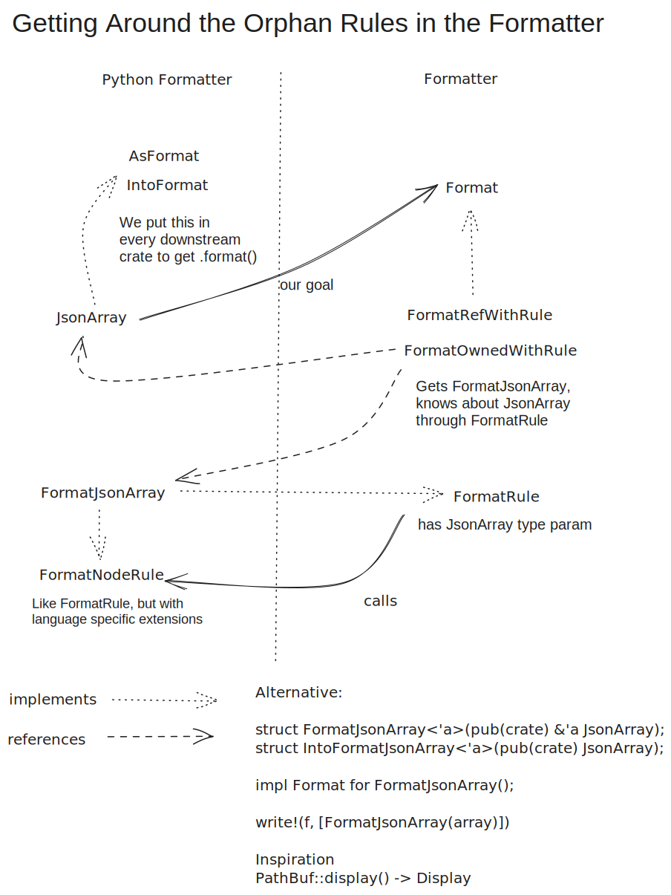

# Rust Python Formatter

The goal of our formatter is to be compatible with Black except for rare edge cases (mostly
involving comment placement).

## Implementing a node

Formatting each node follows roughly the same structure. We start with a `Format{{Node}}` struct
that implements Default (and `AsFormat`/`IntoFormat` impls in `generated.rs`, see orphan rules below).

```rust
#[derive(Default)]
pub struct FormatStmtReturn;
```

We implement `FormatNodeRule<{{Node}}> for Format{{Node}}`. Inside, we destructure the item to make
sure we're not missing any field. If we want to write multiple items, we use an efficient `write!`
call, for single items `.format().fmt(f)` or `.fmt(f)` is sufficient.

```rust
impl FormatNodeRule<StmtReturn> for FormatStmtReturn {
    fn fmt_fields(&self, item: &StmtReturn, f: &mut PyFormatter) -> FormatResult<()> {
        // Here we destructure item and make sure each field is listed.
        // We generally don't need range is it's underscore-ignored
        let StmtReturn { range: _, value } = item;
        // Implement some formatting logic, in this case no space (and no value) after a return with
        // no value
        if let Some(value) = value {
            write!(
                f,
                [
                    text("return"),
                    // There are multiple different space and newline types (e.g.
                    // `soft_line_break_or_space()`, check the builders module), this one will
                    // always be translate to a normal ascii whitespace character
                    space(),
                    // `return a, b` is valid, but if it wraps we'd need parentheses.
                    // This is different from `(a, b).count(1)` where the parentheses around the
                    // tuple are mandatory
                    value.format().with_options(Parenthesize::IfBreaks)
                ]
            )
        } else {
            text("return").fmt(f)
        }
    }
}
```

Check the `builders` module for the primitives that you can use.

If something such as list or a tuple can break into multiple lines if it is too long for a single
line, wrap it into a `group`. Ignoring comments, we could format a tuple with two items like this:

```rust
write!(
    f,
    [group(&format_args![
        text("("),
        soft_block_indent(&format_args![
            item1.format()
            text(","),
            soft_line_break_or_space(),
            item2.format(),
            if_group_breaks(&text(","))
        ]),
        text(")")
    ])]
)
```

If everything fits on a single line, the group doesn't break and we get something like `("a", "b")`.
If it doesn't, we get something like

```Python
(
    "a",
    "b",
)
```

For a list of expression, you don't need to format it manually but can use the `JoinBuilder` util,
accessible through `.join_with`. Finish will write to the formatter internally.

```rust
f.join_with(&format_args!(text(","), soft_line_break_or_space()))
    .entries(self.elts.iter().formatted())
    .finish()?;
// Here we need a trailing comma on the last entry of an expanded group since we have more
// than one element
write!(f, [if_group_breaks(&text(","))])
```

If you need avoid second mutable borrows with a builder, you can use `format_with(|f| { ... })` as
a formattable element similar to `text()` or `group()`.

## Comments

Comments can either be own line or end-of-line and can be marked as `Leading`, `Trailing` and `Dangling`.

```python
# Leading comment (always own line)
print("hello world")  # Trailing comment (end-of-line)
# Trailing comment (own line)
```

Comment are automatically attached as `Leading` or `Trailing` to a node close to them categorization
is automatic except when overridden in `place_comment` in `placement.rs`, which this section is
about. A `Dangling` comment happens when there is node that the comment would be leading or trailing
to.

```Python
[
    # here we use an empty list
]
```

Here, you have to call `dangling_comments` manually and stubbing out `fmt_dangling_comments` default
from `FormatNodeRule` in `FormatExprList`.

```rust
impl FormatNodeRule<ExprList> for FormatExprList {
    fn fmt_fields(&self, item: &ExprList, f: &mut PyFormatter) -> FormatResult<()> {
        // ...

        write!(
            f,
            [group(&format_args![
                text("["),
                dangling_comments(dangling), // Gets all the comments marked as dangling for the node
                soft_block_indent(&items),
                text("]")
            ])]
        )
    }

    fn fmt_dangling_comments(&self, _node: &ExprList, _f: &mut PyFormatter) -> FormatResult<()> {
        // Handled as part of `fmt_fields`
        Ok(())
    }
}
```

A common challenge is that we want to attach comments to tokens (think keywords and syntactically
meaningful characters such as `:`) that have no node on their own. A slightly simplified version of
the `while` node in our AST looks like the following:

```rust
pub struct StmtWhile {
    pub range: TextRange,
    pub test: Box<Expr<TextRange>>,
    pub body: Vec<Stmt<TextRange>>,
    pub orelse: Vec<Stmt<TextRange>>,
}
```

That means in

```python
while True:  # Trailing cond comment
    if f():
        break
    # trailing while comment
# leading else comment
else:
    print("while-else")
```

the `else` has no node, we're just getting the statements in its body.

By default, the comment would get misattributed and moved to the `break` (the first node before the
comment) or the `print` call (the first node after it). We avoid this by finding comments between
two bodies that have the same indentation level as the keyword in
`handle_in_between_bodies_own_line_comment` and marking them as dangling. Similarly, we find and
mark comment after the colon(s). In `FormatStmtWhile`, we take the list of all dangling comments and
split it into after-colon-comments, before-else-comments, etc. and manually insert them in the right
position.

A simplified implementation with only those two kinds comments:

```rust
fn fmt_fields(&self, item: &StmtWhile, f: &mut PyFormatter) -> FormatResult<()> {

    // ...

    let (trailing_condition_comments, or_else_comments) =
        dangling_comments.split_at(or_else_comments_start);

    write!(
        f,
        [
            text("while"),
            space(),
            test.format(),
            text(":"),
            trailing_comments(trailing_condition_comments),
            block_indent(&body.format())
            leading_comments(or_else_comments),
            text("else:"),
            block_indent(&orelse.format())
        ]
    )?;
}
```

## Development notes

Handling parentheses and comments are two major challenges in a Python formatter.

We have copied the majority of tests over from Black and use [insta](https://insta.rs/docs/cli/) for
snapshot testing with the diff between Ruff and Black, Black output and Ruff output. We put
additional test cases in `resources/test/fixtures/ruff`.

The full Ruff test suite is slow, `cargo test -p ruff_python_formatter` is a lot faster.

There is a `ruff_python_formatter` binary that avoid building and linking the main `ruff` crate.

You can use `scratch.py` as a playground, e.g.
`cargo run --bin ruff_python_formatter -- --emit stdout scratch.py`, which additional `--print-ir`
and `--print-comments` options.

The origin of Ruff's formatter is the [Rome formatter](https://github.com/rome/tools/tree/main/crates/rome_json_formatter),
e.g. the ruff_formatter crate is forked from the [rome_formatter crate](https://github.com/rome/tools/tree/main/crates/rome_formatter).
The Rome repository can be a helpful reference when implementing something in the Ruff formatter

## The orphan rules and trait structure

For the formatter, we would like to implement `Format` from the rust_formatter crate for all AST
nodes, defined in the rustpython_parser crate. This violates Rust's orphan rules. We therefore
generate in `generate.py` a newtype for each AST node with implementations of `FormatNodeRule`,
`FormatRule`, `AsFormat` and `IntoFormat` on it.


