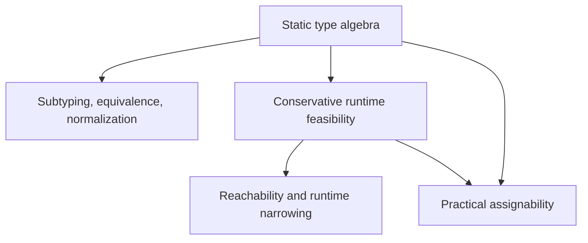

# Preserving structure in uninhabited types

This is a design draft for review and discussion. It proposes a theoretical model for Python typing
that can avoid making all runtime-empty types necessarily assignable to every type (that is, prevent
assigning `tuple[Never]` to e.g. `str`).

## Proposal

Preserve useful static structure even when no runtime value can inhabit it. Keep `Never` as the
unique **static bottom type**. A **runtime-empty type** has no runtime inhabitants, but it need not be
equivalent to `Never`: it can retain static structure that constrains supported operations. Examples
of non-bottom runtime-empty types include `tuple[Never]`, a `TypedDict` with a required `Never` field,
`Bottom[list[Any]]`, and `Bottom[tuple[Any, ...]]`.

This requires three distinct operations:

1. **Static subtyping and simplification** describe an algebra of types that includes shape
    information, not only typed values. Unions and intersections must obey the usual lattice laws.
    Runtime emptiness alone does not imply equivalence to `Never`.
1. **Runtime feasibility and narrowing** reason about realizable values. A runtime-empty
    result can make a control-flow path unreachable without becoming the same static type as `Never`.
1. **Practical assignability** decides whether to report an assignment, argument, or return error.
    It may be more permissive than semantic subtyping, including for fully static types. It must
    respect static equivalence, but it need not obey every lattice law.

The implementation should be conservative, incremental, and inexpensive on ordinary code. A complete
inhabitability solver, a new gradual-soundness guarantee, and a wholesale rewrite of ty's type
representation are all non-goals.

## Terminology and desired behavior

The notation in this document has one meaning throughout:

| Notation                | Meaning                                                                                                                           |
| ----------------------- | --------------------------------------------------------------------------------------------------------------------------------- |
| `S <: T`                | `S` is a semantic **static subtype** of `T`. This is not necessarily equivalent to practical assignability.                       |
| `S ≡ T`                 | The fully static types are equivalent: each is a static subtype of the other.                                                     |
| `S & T`, `S \| T`, `~T` | Static intersection, union, and complement. These are mathematical/internal forms; not all are standard Python annotation syntax. |
| `runtime(T)`            | The set of actual runtime typed values satisfying `T`.                                                                            |
| `assignable(S, T)`      | ty permits a value with source type `S` where target type `T` is required.                                                        |
| Runtime-empty type      | A static type `T` with `runtime(T) = empty`. This includes `Never` and can include types not equivalent to `Never`.               |

The core examples are below.

```text
tuple[Never] != Never
tuple[Never] <: tuple[int]
tuple[Never] <: tuple[str]
tuple[Never] is not assignable to str

tuple[int] & tuple[str] ≡ tuple[Never]        # intended static normalization
runtime(tuple[Never]) = empty

tuple[Never, ...] != tuple[()]
tuple[Never] <: tuple[Never, ...]
runtime(tuple[Never, ...]) = {()}
```

`tuple[Never, ...]` is not itself runtime-empty: the empty tuple inhabits it. But its
static-type meaning is not limited to the empty tuple, it is also a super-type of the runtime-empty
positive-length cases: `tuple[Never]`, `tuple[Never, Never]`, and so on.

For ordinary assignments, preserve the distinction even inside a union:

```text
tuple[Never] | str != str
tuple[Never] | str is not assignable to str
```

For runtime-derived narrowing, however, a runtime-empty tuple alternative should eventually be
removable. Likewise, users should be able to use `tuple[str]` where `~tuple[int]` is expected, even
though the two positive tuple types share `tuple[Never]` as a non-bottom runtime-empty subtype. This
is a characteristic of the assignability relation; it does not mean the static intersection
`tuple[str] & tuple[int]` can be reduced to `Never`.

## Theoretical foundation

### Why ordinary sets of runtime values are insufficient

The current [Python typing concepts specification](https://typing.python.org/en/latest/spec/concepts.html)
explains fully static subtyping through inclusion of runtime-value sets. Taken literally, that makes
every runtime-empty type equivalent to `Never`. Adding runtime-erased static tags to *actual* values
(for `NewType` and generics) does not solve this: there are still no tagged values in an empty set.

The proposed interpretation is still a set algebra. Fully static types denote subsets of a larger
universe containing realizable typed values and formal elements for static structure. Union,
intersection, and complement retain their usual set meanings, and static subtyping is set inclusion
in that universe. The map `runtime(T)` keeps only the realizable typed values. This realization map
is monotone:

```text
S <: T  implies  runtime(S) is a subset of runtime(T)
```

The converse does not hold. It fails for `S = tuple[Never]` and `T = Never`: both runtime sets are
empty, so the runtime inclusion holds, but `tuple[Never]` is not a static subtype of `Never`. If the
converse held for all fully static types, equal runtime sets would imply subtyping in both
directions and therefore static equivalence.

In abstract interpretation, mapping an abstract description to the concrete values it describes is
called **concretization**. Here, `runtime(T)` is that map. If it were **injective**, then whenever
`runtime(S) = runtime(T)`, we must also have `S ≡ T`: no two distinct static meanings could describe
the same runtime set -- this is what we deliberately do not require. Soundness requires only that
static subtyping respect runtime inclusion, as above, and that analysis operations conservatively
account for possible runtime behavior. It does not require throwing away every static distinction
that runtime values cannot express. See Cousot's
[Types as Abstract Interpretations](https://www.di.ens.fr/~cousot/COUSOTpapers/publications.www/Cousot-POPL97-p316-331-1997.pdf)
and Cousot and Cousot's
[Systematic Design of Program Analysis Frameworks](https://www.di.ens.fr/~cousot/COUSOTpapers/POPL79.shtml).

There is also a Python-native precedent here: the informational
[PEP 483](https://peps.python.org/pep-0483/#subtype-relationships) describes static types as being
made up of both values and supported operations, not just values. That language was not carried over
into the typing spec, which may have been a mistake. PEP 483 did not provide a complete treatment of
the implications, but its suggestion that types involve both runtime values and behaviors is
consistent with this proposal. A type like `tuple[Never]` may not have any runtime inhabitants, but
unlike `Never` it still constrains supported operations to those supported by single-element tuples.

### A set-theoretic model with formal elements

To make this precise, let `R` be the set of realizable **typed values**: actual runtime values
together with their runtime-erased static information, such as a `NewType` tag or a generic
specialization. Let `W` extend `R` with **formal elements** that represent static structure but are not
realizable typed values. Write `[[T]]` for the subset of `W` denoted by a fully static type.

```text
[[Never]] = empty
[[object]] = W
[[S | T]] = [[S]] union [[T]]
[[S & T]] = [[S]] intersection [[T]]
[[~T]] = W minus [[T]]
S <: T  iff  [[S]] is a subset of [[T]]
runtime(T) = [[T]] intersection R
```

`[[T]]` represents the full static meaning of `T`, not just its possible runtime values. If
`[[tuple[Never]]]` were empty, it would equal `[[Never]]`, and the two types would be statically
equivalent. To preserve their distinction, the set `W` includes (among other formal elements) one
that records the one-element tuple shape. That element also belongs to the static types
`[[tuple[int]]]` and `[[tuple[str]]]`, as required by covariance, but not to e.g. `[[str]]`.

This formal element belongs to `W`, but not to `R`: no actual Python tuple can have an element of type
`Never`. Thus `[[tuple[Never]]]` is nonempty while `runtime(tuple[Never])` is empty. `Never` remains the
unique static bottom because every type whose *full static set* is empty is equivalent to `Never`.
These formal elements explain the static distinctions we want to preserve; they are not Python
runtime values.

Semantic-subtyping research already uses abstract models rather than requiring every semantic
element to be an actual language value. Frisch, Castagna, and Benzaken's
[Semantic Subtyping](https://www.irif.fr/~gc/papers/semantic_subtyping.pdf), especially its discussion
of semantic models in section 8, gives the relevant distinction.

For tuples, the model preserves the familiar elementwise laws:

```text
tuple[A | B] ≡ tuple[A] | tuple[B]
tuple[A & B] ≡ tuple[A] & tuple[B]
```

If `A & B` is `Never`, the second result is `tuple[Never]`, not `Never`: the element type is empty,
but the static type still records a one-element tuple. Covariance continues to work. Built-in tuple
specializations of different lengths cannot overlap at runtime, but they share the tuple-shaped
bottom defined below. We do not need to choose a concrete representation for the formal elements
to state these requirements.

Being runtime-empty does not make a type the smallest static type with a given shape. For example,
`tuple[Never, int]` is runtime-empty, but `tuple[Never, Never]` is a proper static subtype of it. The
stronger claim that a particular `Bottom[T]` is a greatest lower bound needs its own definition,
discussed below.

For the rest of Python, the model must also account for nominal inheritance, generic variance,
required record fields, callable behavior, recursion, and structural protocols. For example,
preserving `Bottom[list[Any]]` as a non-bottom common subtype of all `list[T]` specializations means
that `list[int]` and `list[str]` statically overlap: their intersection cannot simplify to `Never`.
Similarly, a runtime-empty `TypedDict` must retain its required-key structure. These retained shapes
must still satisfy the relevant inheritance and structural-subtyping rules.

### Implications for the type algebra

**Variable-length tuples.** The
[tuple specification](https://typing.python.org/en/latest/spec/tuples.html) relates a homogeneous tuple
to its fixed-length cases. Preserving runtime-empty fixed-length tuple types therefore requires:

```text
tuple[Never, ...]
  ≡ tuple[()] | tuple[Never] | tuple[Never, Never] | ...
```

This preserves `tuple[Never] <: tuple[Never, ...]`.

**A bottom shared by all tuple lengths.** The
[materialization rules](https://typing.python.org/en/latest/spec/concepts.html#materialization) allow
`tuple[Any, ...]` to become either `tuple[()]` or `tuple[int]`, among other types. We choose a
runtime-empty type `Bottom[tuple[Any, ...]]` as the greatest common subtype of all fully
static built-in `tuple[...]` specializations:

```text
B = Bottom[tuple[Any, ...]]
B != Never
B <: tuple[()]
B <: tuple[int]
B <: tuple[Never]
B <: tuple[()] & tuple[int]
runtime(B) = empty
B is not assignable to str
```

If different lengths instead had `Never` as their static intersection, their common lower bound
would be `Never`. Using that bound to check assignability would accept `tuple[Any, ...]` where `str`
is required. An exact check of the possible materializations need not make that mistake, but this
proposal retains tuple shape in the bound itself, just as it does for invariant generics below.

`B` is a proper subtype of `tuple[Never]`, which still records a one-element shape. It is also
different from `tuple[Never, ...]`, which includes the real empty tuple. Sharing `B` does not make
fixed-length types interchangeable.

An intersection of incompatible lengths must contain `B`, but it may retain more information than
`B` alone. The [materialization discussion](#gradual-types-and-materialization-bounds) explains why
more specific gradual tuples still need to preserve required elements and minimum lengths.

**Invariant generic bottoms.** If `B = Bottom[list[Any]]` is a genuine non-bottom subtype of both
`list[int]` and `list[str]`, then their static intersection cannot be `Never`. This follows from the
meet laws alone:

```text
B <: list[int]
B <: list[str]
therefore B <: list[int] & list[str]
```

The current [materialization tests](../../../ty_python_semantic/resources/mdtest/type_properties/materialization.md)
and [disjointness tests](../../../ty_python_semantic/resources/mdtest/type_properties/is_disjoint_from.md)
still contain incompatible assumptions here. They must eventually be reconciled. Keeping all three
claims would make union/intersection simplification depend on grouping or order. The static
relations need to be reconciled without collapsing `Bottom[list[Any]]` or weakening the lattice
laws.

For example, `(B & list[int]) & list[str]` and `B & (list[int] & list[str])` must have the same
static meaning. The current incompatible assumptions reduce one to `B` and the other to `Never`.

**Complements.** If `E` is a non-bottom runtime-empty type, then `~E` contains every realizable value
but is not statically equivalent to `object`. Non-bottom runtime-empty types therefore have
corresponding runtime-top types that are not static top. A simple pair consisting of a runtime set
and an ordinary runtime-class label is not enough to handle arbitrary complements; the static algebra
must retain the excluded abstract information.

Negation is global: `tuple[int] & ~tuple[int]` is `Never`, but `tuple[int] & tuple[~int]` retains
`tuple[Never]`. Negating an element type is not the same as negating the tuple type.

**Three kinds of overlap.** Each question has a different use:

- **Static overlap** matters to subtyping and simplification. `tuple[int]` and `tuple[str]` share
    `tuple[Never]` as a static subtype, so their intersection must retain it rather than simplify to
    `Never`.
- **Runtime overlap** matters to narrowing and reachability. For `x: tuple[int]`, a trusted predicate
    accepting `object` and returning `TypeIs[tuple[str]]` cannot succeed. The positive branch should
    be unreachable, even though its static intersection is `tuple[Never]`.
- **Object identity** matters to `is` and `is not`. If `UserId` and `OrderId` are distinct `NewType`s
    over `int`, then `UserId(n) is OrderId(n)` is true for the same integer object `n`: each
    [call returns its argument](https://typing.python.org/en/latest/spec/aliases.html#newtype).
    Distinct static tags are therefore not enough to conclude that `is` is false.

## Runtime narrowing and reachability

`runtime(T)` denotes the full set of realizable typed values satisfying `T`, whether or not ty can
compute that set. Types with the same set have the same runtime meaning. For fully static types,
combining the types first and then taking their runtime values gives the same result as applying the
corresponding set operation to their runtime values:

```text
runtime(S | T) = runtime(S) union runtime(T)
runtime(S & T) = runtime(S) intersection runtime(T)
runtime(~T) = R minus runtime(T)
```

Here, `R` is the set of all realizable typed values. All runtime-empty types have the same empty
runtime set, even when they are statically distinct. The implementation need not decide every such
equality; conservative proofs of runtime impossibility are enough.

For a bidirectional runtime predicate represented by guard type `G`, start with the usual raw
constraints `S & G` and `S & ~G`. This matches the intersection-based account in the
[TypeIs specification](https://typing.python.org/en/latest/spec/narrowing.html). `TypeGuard` keeps its
existing one-sided semantics and is not assumed to produce a subtype of the input.

Consider this example in the intended static algebra:

```text
S = tuple[int] | tuple[str, str]
G = tuple[int] | tuple[str, int]

positive raw type: tuple[int] | tuple[str, Never]
positive flow view: tuple[int]

negative raw type: tuple[str, str] & ~tuple[int] & ~tuple[str, int]
negative flow view: tuple[str, str]
```

The positive branch can discard a runtime-empty alternative. The negative branch can discard both
exclusions: neither removes a realizable two-string tuple, even though the types share non-bottom
runtime-empty subtypes.

The governing rule is **preserve the possible runtime values on this control-flow branch**, not
**preserve static equivalence**. The facts known on a branch include the incoming type and the
outcomes of tests that led there. In this example, those facts are already expressed by the raw types
`S & G` and `S & ~G`, so the requirement is `runtime(view) = runtime(raw)`.

A useful flow view need not satisfy `view <: raw`: removing a negative constraint that excludes only
formal elements may enlarge the static denotation. For example, `tuple[str] & ~tuple[int]` is a static
subtype of `~tuple[int]`, but its runtime-equivalent flow view `tuple[str]` is not.

Implementation policy:

- Trust annotations. Do not add taint tracking, runtime checks, or stronger gradual-soundness
    guarantees as part of this design.
- Mark a path unreachable only when runtime impossibility is proved. Failure to prove it means
    “possibly reachable,” not “inhabited.”
- Apply runtime reduction at runtime-derived control-flow edges and relevant operation boundaries.
    Do not put it in the global union or intersection builders.
- Preserve declared types, generic-inference evidence, ordinary assignment types, and unguarded
    joins. In particular, do not silently stop checking the body of
    `def f(x: tuple[Never]): ...` merely because its parameter is impossible under trusted annotations.
- Eventually let exhaustiveness and `assert_never` benefit from an unreachable flow state without
    making a standalone non-bottom runtime-empty type assignable to every `Never` parameter.
- Keep path feasibility separate from a claim that a guard is always true or always false. An
    already-impossible input must not produce contradictory truthiness conclusions.

The first implementation can be a small conservative `is_uninhabitable` type predicate.
`DefinitelyUninhabited` versus `Unknown` is enough; an exact three-way decision procedure is not
required. Start with fixed tuple elements, the shared tuple bottom, incompatible lengths, simple
unions/intersections, and required `TypedDict` fields. Return unknown for unsupported recursive
cases, unresolved type variables, or gradual uncertainty.

Do not infer that a type is runtime-empty merely because an operation returns `Never`: an
always-raising callable or property can exist. Likewise, `list[Never]`, optional `Never` fields, and
`tuple[Never, ...]` have realizable empty cases. Type-variable constraints and gradual alternatives
must be considered conservatively, not by choosing one empty materialization.

## Practical assignability

The static relation remains the fast path and always implies practical assignability. The intended
extension is narrow: permit useful substitutions whose remaining static mismatch is runtime-empty,
while retaining meaningful source and target structure.

Required examples include:

| Source                    | Target        | Intended result                                                |
| ------------------------- | ------------- | -------------------------------------------------------------- |
| `tuple[str]`              | `~tuple[int]` | Accept. Their positive intersection has no runtime inhabitant. |
| `tuple[int]`              | `~tuple[()]`  | Accept. No runtime tuple can have both lengths.                |
| `tuple[Never]`            | `tuple[int]`  | Accept by ordinary static covariance.                          |
| `tuple[Never]`            | `str`         | Reject. Empty runtime meaning does not erase tuple shape.      |
| `tuple[Never] \| str`     | `str`         | Reject outside runtime-derived narrowing.                      |
| `Bottom[tuple[Any, ...]]` | `str`         | Reject. Preserve the shared tuple-shaped static type.          |
| `tuple[Any, ...]`         | `str`         | Reject. Unknown length does not erase tuple shape.             |
| `Bottom[list[Any]]`       | `str`         | Reject. Preserve the list-shaped static type.                  |

The complete relation is **not yet selected**. In particular, runtime-set inclusion alone is too
permissive, while requiring every accepted source to have a real inhabitant rejects valid static
subtyping.

There is a real algebraic tradeoff. Let `E = tuple[Never]`, `X = tuple[int]`, and `Y = tuple[str]`.
We want `E <: X`, `E <: Y`, and `assignable(Y, ~X)`. If assignability also had unrestricted
transitivity and target-intersection introduction, it would follow that `E` is assignable to
`X & ~X`, hence to `Never`, hence to `str`. That is the behavior we are trying to prevent.

The existing [relation checker](../../../ty_python_semantic/src/types/relation.rs) checks a target
intersection one part at a time: the source must satisfy every positive type and be disjoint from
every excluded type, using materialization bounds where needed. This is useful for recursive
checking, type-variable constraints, and error reporting; we'd prefer to retain this implementation.

[Gradual assignability](https://typing.python.org/en/latest/spec/concepts.html#the-assignable-to-or-consistent-subtyping-relation)
is already nontransitive (`int -> Any -> str`), but dropping transitivity for these fully static
cases is not enough on its own. Since `Y ≡ E | Y`, a rule that always checks every source-union
member would also pass `Y -> ~X` down to `E -> ~X`. Combining that with `E -> X` would again give
`E -> Never`. If target intersections can also be decomposed, `Never ≡ Never & str` then gives
`E -> str`.

The preferred direction is therefore to preserve target-intersection checking. The proposed
assignability exception for runtime-only exclusions, such as accepting `tuple[str] -> ~tuple[int]`,
must depend on the whole source type. It must not automatically pass to every static subtype or
every source-union member. This needs more than removing redundant union members: for example,
`Y ≡ E | (Y & ~X)` must receive the same answer as `Y`. Equivalent target forms such as
`Y & ~X ≡ Y & ~E` and `~E ≡ ~X | ~Y` need the same care. A local runtime-disjointness check alone
does not define a complete relation with these properties.

Therefore:

- Preserve the ordinary recursive checker as the fast path. Do not assume practical assignability with
    this exception is transitive or can always be distributed over source unions.
- Require equivalent static source and target representations to give the same answer.
- Keep checking target-intersection parts independently where possible. Any exception that cannot
    use this approach needs an explicit rule for the combined target.
- Never use practical assignability to establish static equivalence, redundancy, or a
    union/intersection rewrite.
- Test the source-union cases above and the equivalent spellings just listed before enabling the
    exception through general recursive checking.

This separation has precedent without dictating Python's exact policy. Rust distinguishes an empty
enum from the special implicit conversions available to its never type. See the
[Rust Reference](https://doc.rust-lang.org/reference/items/enumerations.html#zero-variant-enums).
Castagna and Duboc's
[Elixir type-system paper](https://www.irif.fr/~gc/papers/elixir-type-system.pdf), section 7.2.2,
uses a stricter application-compatibility rule to reject some assignments justified only by an empty
materialization. We can borrow the separation of relations without committing to Elixir's precise
rule or changes to Python's existing `Any` behavior.

## Gradual types and materialization bounds

The shared tuple bottom is part of the static design. It does not, by itself, make every
bound-based gradual-assignability check exact.

Let `M(G)` be the family of fully static materializations of gradual type `G`. The exact existential
question is:

```text
Does some S in M(Source) satisfy S <: T for some T in M(Target)?
```

Replacing that question with `inf M(Source) <: sup M(Target)` is not valid for arbitrary families.
The reverse implication needs a way to obtain actual witnesses; in particular, it works when the
extrema themselves belong to the families. Castagna and Lanvin prove this prerequisite for their
type grammar before using the endpoint reduction in
[Gradual Typing with Union and Intersection Types](https://www.irif.fr/~gc/papers/icfp17.pdf),
Theorem 4 and Proposition 3. Python's invariant generics and gradual tuple lengths need their own
argument.

Three concrete obligations remain:

1. `Bottom[list[Any]]` is a useful static marker, but replacing `Any` with a static element type does
    not necessarily produce that marker. We must either extend the materialization model, retain
    more information about the family, or explicitly describe endpoint-based assignability as a
    different practical relation. [ty #994](https://github.com/astral-sh/ty/issues/994) records the
    original motivation for these markers.
1. `Bottom[tuple[Any, ...]]` is the shared tuple-shaped lower bound chosen above, not
    `tuple[Never, ...]`. We must still decide whether it is itself an allowed materialization.
    Merely being a lower bound does not make it a valid witness for the existential question above.
1. More specific gradual tuples must retain their known constraints. For example,
    `tuple[int, *tuple[Any, ...]]` requires a first element and must not be assignable to `tuple[()]`.
    If every incompatible-length intersection collapsed to the shared tuple bottom, this smaller
    family would have that same lower bound, and a bound-only check would accept the assignment.
    Preserve enough information in the static intersections and bounds, or check the original
    prefix, suffix, and length requirements in practical assignability. Keep these intersections
    symbolic until their normalization rules are specified.

Even an enriched static universe still satisfies `T & Never ≡ Never`. Since `Any` can materialize to
`Never`, a gradual intersection such as `str & Any` can still use a bottom-only witness to justify an
undesirable assignment. That is the separate problem in
[ty #3579](https://github.com/astral-sh/ty/issues/3579), also discussed in the earlier
[Python typing discussion](https://discuss.python.org/t/interactions-with-never-leading-to-undesirable-assignability/99445).

Do not silently change `Any -> Never`, `tuple[Any] -> tuple[Never]`, or other established gradual
behavior while implementing runtime narrowing. An exact materialization-family solver is one
possible future tool, not an immediate requirement. Prefer family-specific proofs and cheap
conservative rules where they suffice.

## Alternatives considered

### Collapse every runtime-empty type to `Never`

This is coherent with a type algebra based only on sets of realizable typed values: every type
whose runtime set is empty is equivalent to `Never`. Static emptiness and runtime emptiness would
ask the same question, and union simplification could discard runtime-empty alternatives without a
separate flow reduction.

The cost is that `tuple[Never]` would be a static subtype of `str`, just as `Never` is. Retaining its
tuple structure as diagnostic metadata could help explain where the type came from, but would not
prevent that assignment. If the metadata changed assignability, it would no longer be only
diagnostic metadata: the checker would need to explain why statically equivalent types receive
different assignment results. This proposal instead keeps that structure in the static type itself.

Zappa Nardelli and coauthors propose collapsing bottom-containing tuples in
[Julia Subtyping: A Rational Reconstruction](https://benchung.github.io/papers/jlsub.pdf), section 5.1,
to resolve a transitivity counterexample. They also describe the resulting loss of known tuple
structure and complications for dataflow analysis. Our choice differs because retaining that
structure is a goal. Their example shows why preserving it also requires a consistent account of
the surrounding subtyping rules.

### Keep different tuple lengths statically disjoint

Reducing intersections of incompatible tuple lengths to `Never` is a simple rule that agrees with
runtime behavior: no tuple can have two different lengths. It could coexist with retaining
runtime-empty element types within each fixed length.

However, the common lower bound of all materializations of `tuple[Any, ...]` would then be `Never`,
because that family includes both `tuple[()]` and `tuple[int]`. An assignability check using only
that lower bound would accept `tuple[Any, ...]` where `str` is required. The bound would no longer
retain the fact that every materialization has tuple structure.

An exact materialization-family check could still reject that assignment, as could a separate
check of the source's tuple structure. This is therefore a possible alternative to the shared
tuple bottom, not an inherently inconsistent design. The proposal chooses to retain tuple
structure in the lower bound itself. Incompatible lengths remain useful evidence of runtime
impossibility, but not of static disjointness.

### Treat `tuple[Never]` as inhabited by a tuple subclass

A tuple subclass can override `__getitem__` with a method that always raises. Since such a method
can have return type `Never`, this may appear to provide a runtime inhabitant of `tuple[Never]`
without introducing formal elements.

But `tuple[Never]` describes a tuple containing exactly one element of type `Never`, not simply an
object whose indexing method never returns. This follows from the element-based meaning in the
[tuple specification](https://typing.python.org/en/latest/spec/tuples.html). Calling
`tuple.__getitem__(value, 0)` bypasses the subclass override and reads the underlying tuple element.
If an element is present, it is a real value and cannot inhabit `Never`. If the underlying tuple is
empty, it does not satisfy the one-element requirement. Overriding `__len__` does not change those
contents either; see [CPython's tuple implementation](https://github.com/python/cpython/blob/v3.14.0/Objects/tupleobject.c).

A checker accepting construction of such a subclass would not establish that the annotation has a
valid runtime inhabitant. The subclass would violate the tuple contract that `tuple[Never]` is
meant to express. Never-returning methods can exist, but they do not supply an element of type
`Never`.

### Use only syntactic or structural rules

One could preserve `tuple[Never]` by recognizing its syntax and adding local rules for covariance,
intersections, and assignments, without giving types a set-theoretic interpretation. Such
algorithms may be straightforward to implement incrementally.

They still need consistent laws, particularly in the presence of arbitrary intersection and negation
types. For example, with `B = Bottom[list[Any]]`, keeping both `B <: list[int]` and `B <: list[str]`
while reducing `list[int] & list[str]` to `Never` makes simplification depend on grouping: `(B & list[int]) & list[str]` reduces to `B`, while `B & (list[int] & list[str])` reduces to `Never`.
Changing the presentation of the rules does not remove that contradiction. (And given
contravariance, the presence of top materializations in the type system inherently requires the
presence of bottom materializations.)

Syntactic and structural algorithms remain appropriate implementations of the proposal, provided
they satisfy its static contracts. The set-theoretic model can explain in a general way which
distinctions those algorithms must preserve and which rewrites are valid; a solely rules-based
system is inherently ad-hoc.

### Use one disjointness or emptiness relation everywhere

A single relation would give normalization, narrowing, and reachability a common API and avoid
maintaining separate proof modes. For types whose static and runtime overlap agree, the distinction
would make no difference.

The tuple examples require different answers. `tuple[int]` and `tuple[str]` overlap statically
through `tuple[Never]`, but have no common runtime inhabitant. If the shared relation reports them
as disjoint, static intersection simplification loses the retained tuple structure. If it reports
them as overlapping, a runtime consumer cannot use that answer to prove the corresponding
`TypeIs` branch unreachable.

The proposal separates the questions so each consumer gets the answer it needs. Recursive
machinery may still be shared, but its results must distinguish static disjointness from runtime
impossibility. Keeping a conservative static answer everywhere would avoid an invalid rewrite,
but would also leave the desired runtime narrowing improvements unimplemented.

### Remove runtime-empty union members globally

At runtime, an empty alternative contributes no values. Removing it from every union would give
simpler displayed types and make some exhaustiveness checks easier without requiring a separate
flow reduction.

As a static rewrite, however, it breaks the union's relationship to its members:

```text
E = tuple[Never]
E <: E | str
E is not a static subtype of str
```

If `E | str` were statically equivalent to `str`, union introduction would force `E <: str`,
contrary to the retained tuple structure. The same problem applies when the union occurs in a
declared type or a type alias, not only in a displayed narrowing result.

Runtime-derived flow can remove an alternative once it is proved impossible on that branch.
Global union builders must instead preserve static equivalence, including runtime-empty members
that are not already redundant under static subtyping.

### Define assignability solely by runtime-set inclusion

The rule `assignable(S, T)` iff `runtime(S)` is a subset of `runtime(T)` directly expresses that
every possible source value satisfies the target. It would accept the desired
`tuple[str] -> ~tuple[int]` example and would give assignability familiar set-inclusion laws.

But every empty runtime set is a subset of every target's runtime set. The rule would therefore
accept `tuple[Never] -> str`, losing the distinction the proposal is meant to preserve. The problem
is not limited to entirely empty sources: `tuple[Never] | str` has the same runtime set as `str`,
so this rule would also accept that assignment outside runtime-derived narrowing.

Runtime inclusion can justify a particular runtime-based compatibility check, but it does not
retain enough static information to define the complete practical-assignability relation.

### Require every assignment source to have a runtime inhabitant

Requiring an inhabited source would prevent an assignment from succeeding only because the source
has an empty runtime set. As a requirement on every assignment, however, it would also reject
`tuple[Never] -> tuple[int]`, which is valid static covariance, and assignments from `Never` itself.
That would violate the requirement that static subtyping always implies practical assignability.

Restricting only a runtime-inclusion fallback to inhabited sources avoids that particular problem,
but still does not preserve all the required structure. `tuple[Never] | str` has real string
inhabitants and the same runtime set as `str`; such a fallback would accept the assignment that
the proposal explicitly rejects.

Proven inhabitance may be a useful condition for a restricted assignability exception. It is not
a sufficient general rule, and failure to prove runtime emptiness is not proof of inhabitance.
The existing static-subtyping and gradual-materialization rules still need to be respected.

### Require flow views to be static subtypes of the raw narrowing result

This requirement would let every flow reduction be justified using the same static-subtyping
relation as ordinary type operations. Later static checks could rely on the reduced type retaining
all constraints imposed by the raw result.

It prevents the desired simplification of negative branches. For example:

```text
raw = tuple[str] & ~tuple[int]
view = tuple[str]

runtime(raw) = runtime(view)
raw <: view
view is not a static subtype of raw
```

The raw type excludes formal elements shared with `tuple[int]`; the flow view includes them.
Removing the exclusion adds no runtime values, but it enlarges the static set. Requiring
`view <: raw` would force the flow type to keep this runtime-irrelevant exclusion.

The proposal uses runtime equivalence to justify that flow reduction. Which later checks, if any,
need the unreduced static facts remains a separate decision about assignment checking and generic
inference; the subtype requirement would prevent the reduction before those questions arise.

### Build a complete inhabitability solver first

A broad solver could centralize runtime-feasibility reasoning and cover combinations of tuples,
records, callables, recursive types, and protocols without adding a separate rule for each reported
bug. That could eventually support more uniform narrowing and exhaustiveness behavior.

Building it first would make the initial change depend on decisions about recursion, unresolved
type variables, gradual alternatives, caching, and performance that the ordinary tuple examples do
not require. Even a complete runtime solver would not reconcile contradictory static meet laws or
choose the practical-assignability policy: runtime emptiness and static bottom would still differ.

The initial proof procedure only needs to distinguish `DefinitelyUninhabited` from `Unknown`.
Supported tuple and required-field cases can improve useful flow paths while unsupported cases
remain conservatively reachable. Broader solver support is deferred until concrete bugs and
performance measurements justify it; it is not rejected as a possible implementation technique.

## Implementation boundaries



Use the existing architecture before adding representations or relation modes:

| Area                                         | Likely code                                                                                                                                                                                                                        | Intended responsibility                                                                                                   |
| -------------------------------------------- | ---------------------------------------------------------------------------------------------------------------------------------------------------------------------------------------------------------------------------------- | ------------------------------------------------------------------------------------------------------------------------- |
| Tuple representation and element relations   | [tuple.rs](../../../ty_python_semantic/src/types/tuple.rs)                                                                                                                                                                         | Preserve static lengths and element types; reuse `TupleSpecBuilder::intersect` where appropriate.                         |
| Static relations and practical compatibility | [relation.rs](../../../ty_python_semantic/src/types/relation.rs)                                                                                                                                                                   | Keep `Subtyping`, `Assignability`, and `Redundancy` distinct; document any fully-static assignability exception.          |
| Static normalization                         | [set_theoretic/builder.rs](../../../ty_python_semantic/src/types/set_theoretic/builder.rs)                                                                                                                                         | Apply static-equivalence rewrites only; never use runtime-only emptiness to erase a type.                                 |
| Invariant materializations                   | [generics.rs](../../../ty_python_semantic/src/types/generics.rs), [types.rs](../../../ty_python_semantic/src/types.rs)                                                                                                             | Reconcile marker bounds, specialization overlap, and variance.                                                            |
| Runtime proofs and flow                      | [narrow.rs](../../../ty_python_semantic/src/types/narrow.rs), [reachability.rs](../../../ty_python_semantic/src/reachability.rs)                                                                                                   | Consume definite-impossibility proofs at selected CFG edges; retain conservative fallbacks.                               |
| Identity comparisons                         | [infer/comparisons.rs](../../../ty_python_semantic/src/types/infer/comparisons.rs)                                                                                                                                                 | Distinguish impossible runtime identity from static/tagged disjointness.                                                  |
| Exact runtime operations                     | [call/bind.rs](../../../ty_python_semantic/src/types/call/bind.rs), [class.rs](../../../ty_python_semantic/src/types/class.rs), [binary_expressions.rs](../../../ty_python_semantic/src/types/infer/builder/binary_expressions.rs) | Preserve known-empty operation results locally without changing annotation normalization or bypassing subclass overrides. |
| Algebraic regression tests                   | [property_tests.rs](../../../ty_python_semantic/src/types/property_tests.rs), [type-properties mdtests](../../../ty_python_semantic/resources/mdtest/type_properties)                                                              | Test the static laws separately from runtime feasibility and compatibility policy.                                        |

For practical assignability, investigate a small fully-static fragment such as fixed tuples of
known-inhabited primitive or literal types and simple tuple exclusions. Leave runtime-empty sources
on the existing assignability rules; do not apply the new runtime-only exception. An `Unknown`
emptiness result is not proof of a runtime inhabitant. Even proven inhabitance does not justify a
general rule: `tuple[int | tuple[Never]]` has real values but also contains a runtime-empty alternative
that a blanket runtime-only test could erase. Broader support needs a source-sensitive rule that
preserves required static structure and works with equivalent source and target forms. Do not replace
the shared static-disjointness check with runtime disjointness.

Keep `Type::is_never` cheap and about canonical static bottom. Do not replace all of its callers with
a recursive runtime-emptiness query. Audit each consumer according to the question it needs to
answer.

If a second disjointness operation shares recursive machinery with the existing checker, its mode
must be part of the visitor/cache identity, or it must use a separate visitor. The current relation
visitor includes `TypeRelation` in its key; the disjointness visitor is keyed by the type pair.
Accidentally reusing a result across static and runtime interpretations would be a correctness bug.

Start with cheap syntactic gates, existing interned types, and existing constraint/recursion guards.
Do not allocate and normalize `S & ~T` repeatedly just to ask a local tuple question. Cache expensive
queries only where measurements justify it, and include the environment or constraints needed for a
valid answer. Preserve Salsa dependency boundaries. Avoid eagerly distributing large unions,
enumerating tuple lengths, or multiplying materialization alternatives.

## Staged implementation plan

### Stage 1: Establish the static contracts and tuple-shape invariants

Use tuples as the first concrete application of the model. Preserve fixed-length, homogeneous, and
mixed `Never` tuple shapes. Establish `Bottom[tuple[Any, ...]]` as a non-`Never` common subtype of
every fully static built-in tuple specialization. Test that different lengths overlap statically but
not at runtime, and that the shared bottom remains distinct from length-specific runtime-empty tuple
types. Protect these rules with mdtests and properties such as `tuple[T] <: tuple[T, ...]`, plus
assignment rejections for `tuple[Any, ...] -> str` and `tuple[int, *tuple[Any, ...]] -> tuple[()]`.
Preserve precise results for known-empty runtime operations at the operation boundary.

Turn the other examples in this document into small mdtests and property-test cases. Specify what
`Bottom[T]` means for invariant families and what static intersections must preserve. Add the
invariant-list associativity counterexample as an expected failure before fixing it.

Exit criteria: stable tuple-shape laws, an explicit record of supported static laws and known
failures, no runtime-only criterion in static normalization, and agreed expected results for the
tuple-length and invariant-bottom cases.

### Stage 2: Repair static normalization in useful type families

Implement elementwise normalization of compatible tuple intersections, including the retained
`Never` result. Reuse existing tuple intersection machinery and preserve variadic shape. Check
TypeVarTuple substitution so an intersected pack does not become a nested homogeneous tuple.
Represent the shared tuple bottom and preserve it in incompatible-length intersections. Retain
additional prefix, suffix, and length information where needed; keep intersections symbolic until
their normalization is specified. Address mixed prefix/suffix alignment separately if it requires a
broader algorithm.

Then reconcile invariant generic overlap with genuine non-bottom `Bottom[...]` types. Preserve
nominal distinctions and variance; do not invent a single untyped bottom for all containers.

Exit criteria: order-independent simplification in the repaired families, tuple-pack regression
coverage, and passing focused associativity/subtyping properties. Each family can ship separately.

### Stage 3: Add conservative runtime-impossibility proofs

Introduce a separately named proof API without changing `is_never` or static disjointness. Start with
the tuple and required-field cases needed by real narrowing examples. Handle recursion and type
variables conservatively, and keep an explicit unknown result or equivalent one-sided contract.

Exit criteria: focused positive and negative tests for proof soundness, cycle termination, correct
empty-container behavior, no cache-mode contamination, and measured cost on representative ty
workloads. Unsupported cases remain reachable.

### Stage 4: Use those proofs in runtime flow

Integrate first at a narrow set of tuple-length checks, `isinstance`, `TypeIs`, and
match/exhaustiveness consumers. Drop proven-impossible alternatives on those paths. Add
negative-branch reduction for exclusions that only remove formal elements. Preserve the
existing TypeGuard distinction and ordinary declared/assignment types.

Audit identity comparisons, call-return reachability, and `assert_never` as separate consumers rather
than mechanically changing every bottom check.

Exit criteria: readable positive and negative narrowing results, explicit consumer contracts and tests
for assignment checking and generic inference, preserved static aliases, no suppression of unrelated
function-body diagnostics, and acceptable ecosystem and performance results. Exact global flow
normalization is not required.

### Stage 5: Add practical compatibility for runtime-only exclusions

Specify how the exception composes with source unions, target intersections, and equivalent Boolean
forms before implementing a general rule. Prefer retaining the existing target-intersection
checking. Start with `tuple[str] -> ~tuple[int]` and nearby fully-static cases, using existing
assignability as the fast path. Keep all simplification and equivalence modes unchanged.

Exit criteria: the acceptance/rejection table above passes; equivalent static spellings produce the
same result, including the source-union and negation examples; source decomposition and target
grouping cannot bypass shape requirements; ordinary gradual behavior is unchanged unless separately
approved. Record which algebraic properties this relation deliberately does not promise.

### Stage 6: Revisit gradual materialization and broader coverage

Using the static bounds agreed in Stage 1, resolve the remaining materialization questions for
gradual tuple lengths and invariant generics, along with bottom-only witnesses such as #3579.
Compare exact symbolic materialization families, family-specific endpoint proofs, and an explicitly
different practical-compatibility relation. Do not import an endpoint theorem whose hypotheses
Python's type forms do not satisfy.

Only expand runtime proofs to recursive protocols, more generic families, and more elaborate flow
relations when concrete bugs and performance data justify the complexity.

## Validation and open decisions

For fully static types, retain or grow property tests for reflexivity and transitivity of subtyping;
union introduction and intersection elimination; associativity, commutativity, idempotence, and
absorption; and equivalence-preserving normalization. Static disjointness must never report a
non-bottom common subtype as impossible. The property suite should exercise non-bottom runtime-empty
types and different construction/grouping orders explicitly.

Test runtime proofs separately against small models with known realizability. Test flow reduction for
preservation of runtime meaning under a guard, not static equivalence. Test practical assignability
for the chosen user-facing cases and invariance under static-equivalent representations, not for
unagreed lattice laws.

The main decisions still needing review are:

1. How to represent and normalize incompatible-length tuple intersections and the more specific
    bounds needed by gradual tuples with required elements.
1. The source-sensitive practical-assignability rule, including source unions, target-intersection
    checking, and equivalent negative targets.
1. The representation and normalization of intersections between invariant specializations.
1. Which consumers should use runtime-reduced flow types, and what static facts, if any, must remain
    available. If any are needed, can existing narrowing machinery retain or reconstruct them without
    adding per-binding overhead?
1. The scope and budget of runtime-impossibility proofs, and which consumers should use them first.
1. Whether synthetic `Bottom`/`Top` markers extend the materialization model or belong only to a
    separate practical relation.

These are reasons to stage the work, not reasons to weaken the static algebra or claim that the
current implementation already provides a complete theory.
