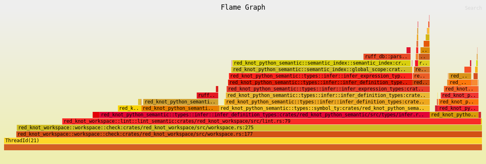

# Tracing

Traces are a useful tool to narrow down the location of a bug or, at least, to understand why the compiler is doing a
particular thing.
Note, tracing messages with severity `debug` or greater are user-facing. They should be phrased accordingly.
Tracing spans are only shown when using `-vvv`.

## Verbosity levels

The CLI supports different verbosity levels.

- default: Only show errors and warnings.
- `-v` activates `info!`: Show generally useful information such as paths of configuration files, detected platform,
    etc., but it's not a lot of messages, it's something you'll activate in CI by default. cargo build e.g. shows you
    which packages are fresh.
- `-vv` activates `debug!` and timestamps: This should be enough information to get to the bottom of bug reports. When
    you're processing many packages or files, you'll get pages and pages of output, but each line is link to a specific
    action or state change.
- `-vvv` activates `trace!` (only in debug builds) and shows tracing-spans: At this level, you're logging everything.
    Most of this is wasted, it's really slow, we dump e.g. the entire resolution graph. Only useful to developers, and you
    almost certainly want to use `TY_LOG` to filter it down to the area your investigating.

## Better logging with `TY_LOG` and `TY_MAX_PARALLELISM`

By default, the CLI shows messages from the `ruff` and `ty` crates. Tracing messages from other crates are not shown.
The `TY_LOG` environment variable allows you to customize which messages are shown by specifying one
or
more [filter directives](https://docs.rs/tracing-subscriber/latest/tracing_subscriber/filter/struct.EnvFilter.html#directives).

The `TY_MAX_PARALLELISM` environment variable, meanwhile, can be used to control the level of parallelism ty uses.
By default, ty will attempt to parallelize its work so that multiple files are checked simultaneously,
but this can result in a confused logging output where messages from different threads are intertwined and non
determinism.
To switch off parallelism entirely and have more readable logs, use `TY_MAX_PARALLELISM=1` (or `RAYON_NUM_THREADS=1`).

### Examples

#### Show all debug messages

Shows debug messages from all crates.

```bash
TY_LOG=debug
```

#### Show salsa query execution messages

Show the salsa `execute: my_query` messages in addition to all ty messages.

```bash
TY_LOG=ruff=trace,ty=trace,salsa=info
```

#### Show typing traces

Only show traces for the `ty_python_semantic::types` module.

```bash
TY_LOG="ty_python_semantic::types"
```

Note: Ensure that you use `-vvv` to see tracing spans.

#### Show messages for a single file

Shows all messages that are inside of a span for a specific file.

```bash
TY_LOG=ty[{file=/home/micha/astral/test/x.py}]=trace
```

**Note**: Tracing still shows all spans because tracing can't know at the time of entering the span
whether one if its children has the file `x.py`.

**Note**: Salsa currently logs the entire memoized values. In our case, the source text and parsed AST.
This very quickly leads to extremely long outputs.

## Tracing and Salsa

Be mindful about using `tracing` in Salsa queries, especially when using `warn` or `error` because it isn't guaranteed
that the query will execute after restoring from a persistent cache. In which case the user won't see the message.

For example, don't use `tracing` to show the user a message when generating a lint violation failed
because the message would only be shown when linting the file the first time, but not on subsequent analysis
runs or when restoring from a persistent cache. This can be confusing for users because they
don't understand why a specific lint violation isn't raised. Instead, change your
query to return the failure as part of the query's result or use a Salsa accumulator.

## Tracing in tests

You can use `ruff_db::testing::setup_logging` or `ruff_db::testing::setup_logging_with_filter` to set up logging in
tests.

```rust
use ruff_db::testing::setup_logging;

#[test]
fn test() {
    let _logging = setup_logging();

    tracing::info!("This message will be printed to stderr");
}
```

Note: Most test runners capture stderr and only show its output when a test fails.

Note also that `setup_logging` only sets up logging for the current thread because
[`set_global_default`](https://docs.rs/tracing/latest/tracing/subscriber/fn.set_global_default.html) can only be
called **once**.

## Release builds

`trace!` events are removed in release builds.

## Profiling

ty generates a folded stack trace to the current directory named `tracing.folded` when setting the environment variable
`TY_LOG_PROFILE` to `1` or `true`.

```bash
TY_LOG_PROFILE=1 ty -- --current-directory=../test -vvv
```

You can convert the textual representation into a visual one using `inferno`.

```shell
cargo install inferno
```

```shell
# flamegraph
cat tracing.folded | inferno-flamegraph > tracing-flamegraph.svg

# flamechart
cat tracing.folded | inferno-flamegraph --flamechart > tracing-flamechart.svg
```



See [`tracing-flame`](https://crates.io/crates/tracing-flame) for more details.
