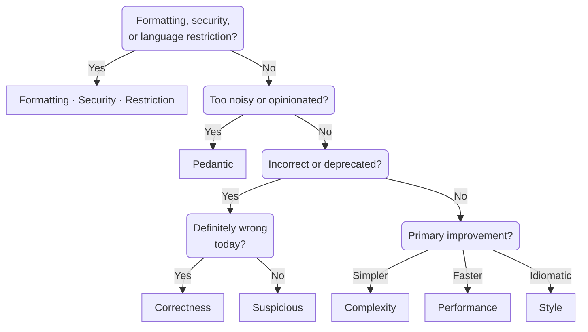

# Proposing Lint Rules

Rule suggestions can start out as brief issues. If a maintainer thinks the rule could be a good
addition to Ruff, they will apply the `needs-design` label to suggest filling out the steps
described below in support of the rule's acceptance. Some of this information will be easier to
obtain with a working rule implementation and doesn't need to be present in the initial proposal.

A design for a new lint rule in Ruff should include the following components:

- A proposed name that follows our [rule naming convention](#rule-naming-convention)

- A proposed category that follows our [rule categorization guidelines](#rule-categorization-guidelines)

- A draft of the rule documentation with the following sections:

    - "What it does": a one line description of what the rule checks
    - "Why is this bad?": a longer explanation of the pattern flagged by the rule and why it causes problems in real projects
    - "Example": a code example showing the problematic code, as well as a code block showing the fixed code

    Some rules benefit from additional documentation. These sections usually emerge through the
    implementation process and aren't required in a design proposal. "Fix safety" and "Options"
    sections are required for rules with unsafe fixes and that rely on any settings, respectively,
    but the rest of these are fully optional. You can `grep` for each heading to see where they are
    often used.

    - "Known problems": any known limitations of the rule, such as false positives or negatives
    - "Fix availability": if the rule only has an autofix in some cases, explain why
    - "Fix safety": if the rule’s fix is ever unsafe, explain why
    - "Options": if the rule depends upon any configuration options, list them
    - "See also": if there are other similar or synergistic rules, list them
    - "References": if there are any relevant external references to Python or other documentation, list them

    A few examples of great rule documentation include [`mutable-argument-default` (`B006`)][b006],
    [`quoted-annotation` (`UP037`)][up037], and [`used-dummy-variable` (`RUF052`)][ruf052].

- An example diagnostic including the proposed name, primary message, and fix title (if applicable)

    This is another nice bonus that isn't required for a design proposal but concisely reveals a lot
    of helpful information about a rule. For example:

    ```markdown
    my-new-rule: primary diagnostic message
     --> example.py:1:1
    1 | import math
      |        ^^^^
    help: fix title
    ```

    When choosing a diagnostic range (marked by `^^^^` above), also consider that the start of the
    range determines where `noqa` comments will be valid

## Rule naming convention

Like Clippy, Ruff's rule names should make grammatical and logical sense when read as "ignore
${rule}" or "ignore ${rule} items", as in the context of suppression comments.

For example, `AssertFalse` fits this convention: it flags `assert False` statements, and so a
suppression comment would be framed as "ignore `assert False`".

As such, rule names should...

- Highlight the pattern that is being linted against, rather than the preferred alternative.
    For example, `AssertFalse` guards against `assert False` statements.

- _Not_ contain instructions on how to fix the violation, which instead belong in the rule
    documentation and the `fix_title`.

- _Not_ contain a redundant prefix, like `Disallow` or `Banned`, which are already implied by the
    convention.

When re-implementing rules from other linters, we prioritize adhering to this convention over
preserving the original rule name.

## Rule categorization guidelines

Choosing a category is a crucial part of the rule proposal and acceptance process. To paraphrase the
[Clippy documentation](https://rust-lang.github.io/rfcs/2476-clippy-uno.html#what-lints-belong-in-clippy),
if a rule doesn't fit in the categories, it probably doesn't fit in Ruff. Descriptions of each category can
be found in the [rule category documentation](linter.md#rule-categories),
but the flow chart below is intended to facilitate category assignment.



The first question filters out special categories of rules: those that relate to the visual
presentation of code (`formatting`), those that relate to `security` vulnerabilities, and those that
impose `restriction`s on language features. "Restriction" here specifically means an arbitrary or
severe restriction, not the broad way in which any lint rule could be considered to restrict usage.
Examples of restriction lints are rules like `assert` (`S101`) and `print` (`T201`), which ban basic
language features across the board.

If none of these special categories is quite right, the next question asks you to judge whether the
rule is too noisy or opinionated for general use. This is somewhat subjective, but an [ecosystem
report](https://docs.astral.sh/ruff/contributing/#ecosystem-report) can be helpful to see how many
diagnostics are emitted in real projects.
A large number of diagnostics doesn't immediately make a rule `pedantic`, but many false positives
or diagnostics that reasonable Python users would disagree with do.

If a rule is not overly pedantic, we next consider the intention of the rule. If the main goal is
detecting code that is incorrect, the options narrow to `correctness` or `suspicious`. Rules in the
`correctness` category typically cause immediate issues like syntax or runtime errors, or silently
do something the user didn't intend. Similarly, `suspicious` lints flag the same kind of code, but
in cases where Ruff can't be sure what the user intended. A perfect example of a `suspicious` rule
is `mutable-argument-default` (`B006`). This classic footgun is almost always a mistake, but in some
cases, it may be intentional, in which case a `noqa` or `ruff: ignore` comment should be used. Such
suppression comments should essentially never be reasonable for a `correctness` lint but are fine
for `suspicious` lints. The `suspicious` category also includes deprecations, which aren't incorrect
today but will cause errors in the future.

The final branch of the flow chart deals with stylistic lints, which are again somewhat subjective
to differentiate between changes that make code simpler often also make the code faster and
more idiomatic. Thus, the question prompts you to consider the _primary_ improvement. Rules that
primarily make code simpler are `complexity` lints, those that primarily make code faster or use
less memory are `performance` lints, and those that primarily make code more idiomatic are `style`.

## Other guidelines

Following these steps should generally ensure that a rule is a good fit for Ruff. A couple of
additional things to watch out for are:

- Rules that conflict with other tools, or especially other rules

    Although we have many existing `formatting` rules that overlap and even conflict with our
    formatter, we are not eager to add more. Similarly, we should avoid rules that mainly support
    type checker usage, when type checkers themselves emit similar diagnostics. Most clearly, we
    should avoid rules that overlap or conflict with other lint rules. This often suggests that the
    existing rule should instead be made configurable to toggle between the two behaviors.

    Checking both the input and output examples from your rule proposal with `ALL` rules selected in
    the [linter], with the [formatter], and with a [type checker] like ty is a good quick check for
    conflicts.

- Rules that apply to third-party libraries

    Most Ruff rules should be helpful for large numbers of Python developers. This means that rules
    should generally apply to Python language features or functionality from the standard library.
    However, rules for widely-used third-party libraries can also meet this bar and be good
    candidates for inclusion in Ruff.

- Rules that require additional configuration

    Most rules should function correctly once enabled without requiring additional settings. If this
    isn’t possible, the rule should typically “fail safe” and avoid emitting diagnostics.
    `banned-api` (`TID251`) is an example of such a rule that has no effect without configuring
    `lint.flake8-tidy-imports.banned-api`. Avoid rules that emit a ton of diagnostics until some
    kind of allowlist is configured.

- Rules that are hard to explain

    This guideline is inspired by ESLint’s “Generic” [rule guideline](https://eslint.org/docs/latest/contribute/propose-new-rule#core-rule-guidelines):

    > Rules cannot be so specific that users will have trouble understanding when to use them. A
    > rule is typically too specific if describing what it does requires more than two "and"s (if a
    > and b and c and d, then this rule warns).

    Watch out for this kind of pattern when writing your `Why is this bad?` or `Known problems`
    section, or if you have a hard time categorizing the rule. The `pedantic` category exists to
    hold rules that are controversial or niche, but very niche rules may still not be good fits for
    Ruff.

[b006]: https://docs.astral.sh/ruff/rules/mutable-argument-default/
[formatter]: https://play.ruff.rs/1265904d-f03c-4d22-aa87-1e6ca16708c2?secondary=Format
[linter]: https://play.ruff.rs/1265904d-f03c-4d22-aa87-1e6ca16708c2
[ruf052]: https://docs.astral.sh/ruff/rules/used-dummy-variable/
[type checker]: https://play.ty.dev/b2d4212e-1243-4d75-a340-ae6ff2e2a6ca
[up037]: https://docs.astral.sh/ruff/rules/quoted-annotation/
